# Project Overview &nbsp; 📜

SaaSLand is a modern, responsive, and conversion-optimized landing page template built with Next.js and Tailwind CSS. It’s specifically crafted for SaaS products, focusing on showcasing product features, capturing leads, and driving user engagement. By integrating insights from top-tier SaaS marketers and advanced dev teams, SaaSLand is built to address the most common pain points and deliver an intuitive, high-performing user experience.

### Live Project Link:

⭐️ [https://saas-land.vercel.app/](https://saas-land.vercel.app/) ⭐️

---

### Table of Contents 📚

- [Getting Started](#getting-started-%EF%B8%8F)
- [How to Use This Documentation](#how-to-use-this-documentation-%EF%B8%8F)
- [Component-Specific Instructions](#component-specific-instructions-%EF%B8%8F)
  - [Banner](#banner-)
  - [About](#about-)
  - [Features](#features-)
  - [How It Works](#how-it-works-)
  - [Pricing](#pricing-)
  - [Testimonials](#testimonials-)
  - [Clients](#clients-)
  - [Tools](#tools-)
  - [CTA](#cta-)
  - [Contact](#contact-)
  - [Footer](#footer-)
- [Deployment](#deployment-%EF%B8%8F)
- [Contributors](#contributors-)
- [How to Contribute](#how-to-contribute-%EF%B8%8F)
- [Conclusion](#conclusion-)

---

## Getting Started &nbsp; ⚙️

 
First, install the packages and run the development server:

 

    npm install && npm run dev

Open [http://localhost:3000](http://localhost:3000) in your browser to see the result.

If you see this, you're ready to start turning this template into your own **SaaS marketing page** 👌

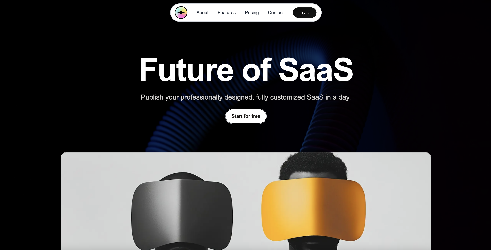
##

 

## How to use this documentation 📄

There are five sections, and each has specific instructions to help you modify its content.

#### First, get familiar with Tailwind CSS
Follow this link if you're new to Tailwind: [Tailwind Installation](https://tailwindcss.com/docs/installation).

- Your Tailwind settings are already configured. You only need to use the basic CSS classes provided by Tailwind to adjust colors, sizes, margins, paddings, etc.

But how do you do this?

- Use your editor’s quick search feature to find Tailwind classes. You can also try ´ctrl + k´ / 'cmd + k'
 
  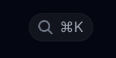

For example, if you want to change colors:

- Scroll through the search results and look for "customizing colors".

  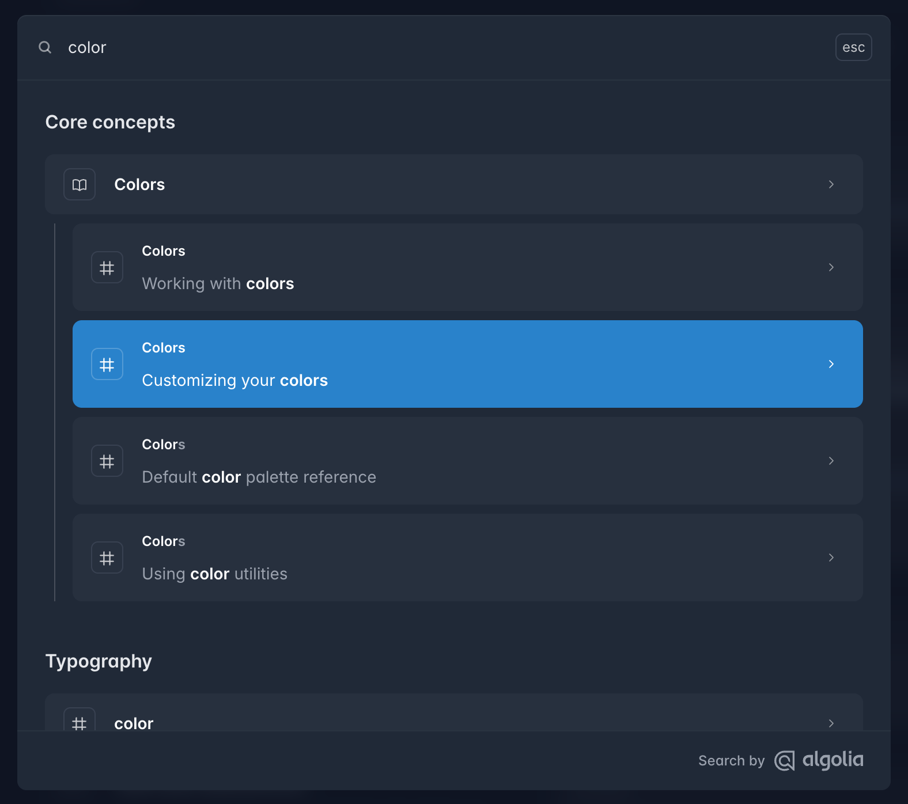

 

All color codes are ready for you—just type the color name and token code. For instance, using "slate-50" will give you the color `#f8fafc`.

In Tailwind, you assign styles by adding class names to elements. For example:

Adding the class `background-slate-50` to an element will apply the slate-50 background color.

 

  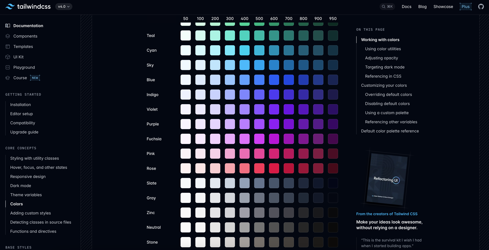
  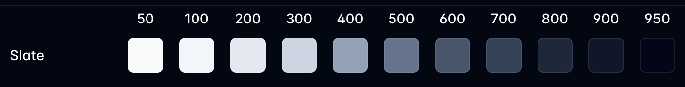

#### ✨ Important Hint:
If you ever forget the name of a CSS flex setting, don't waste time scrolling through the documentation. Instead, ask your coding assistant (GPT, Copilot, Gemini) for help—it saves time and frustration!

Tailwind is simpler than it seems; you’ll grasp the essentials in 10-15 minutes. For this project, simply updating the content is enough to create your personalized SaaS landing page.

#### Second, let's get to know the components and their content.

- **Banner** 🏠  
  A section featuring a bold headline, a concise subheading, a compelling call-to-action button, and a dynamic background (vide but you can change it with an img also).  

  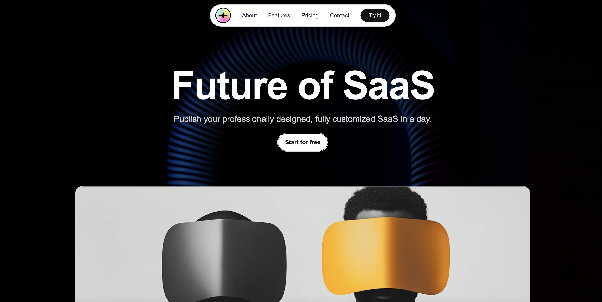
    

- **Clients** 🔍  
  As clear as the name the companies that you worked with represented in a fancy way with a constant sliding and grayscale.  

  
    

- **About** 🙎‍♂️  
  A section that explains the purpose of your SaaS product, highlights its benefits, and may include a brief introduction along with engaging visuals.

  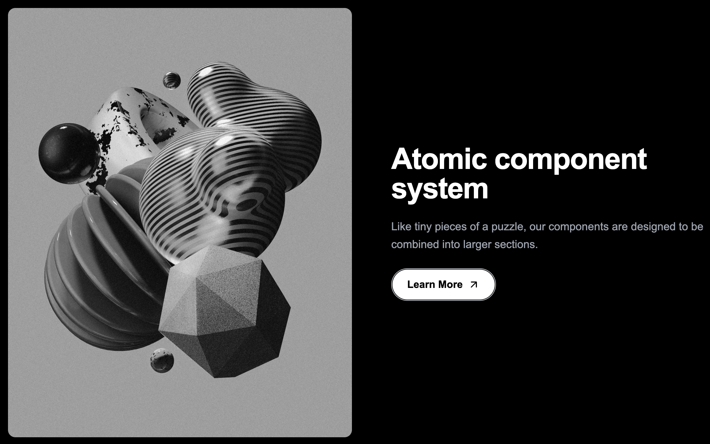
    

- **Features** 🔄  
  The part that you showcase best features of your product. 

  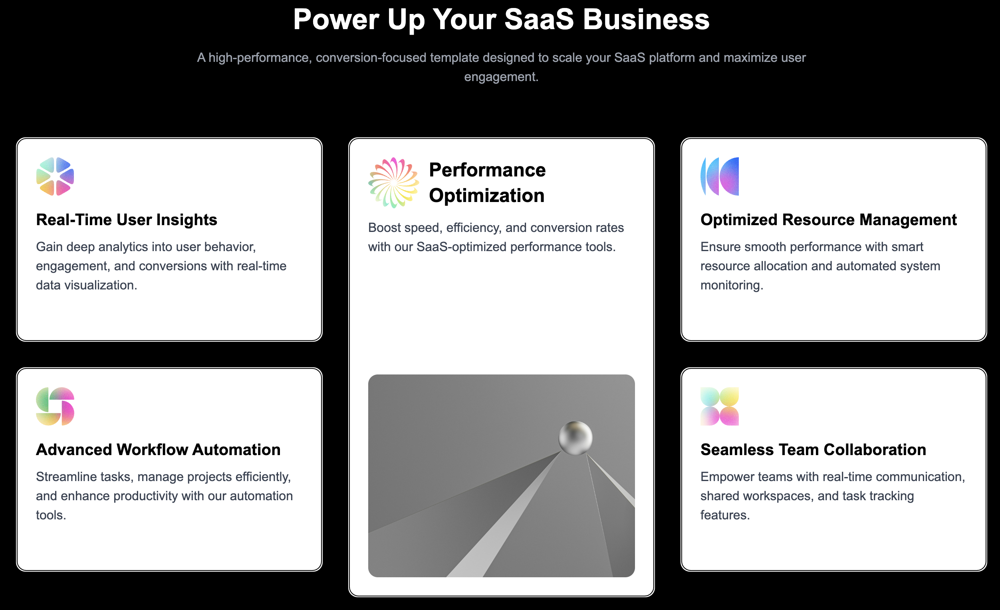
    

- **Tools** 🛠  
  A showcase of the technologies and tools that power your SaaS product. 

  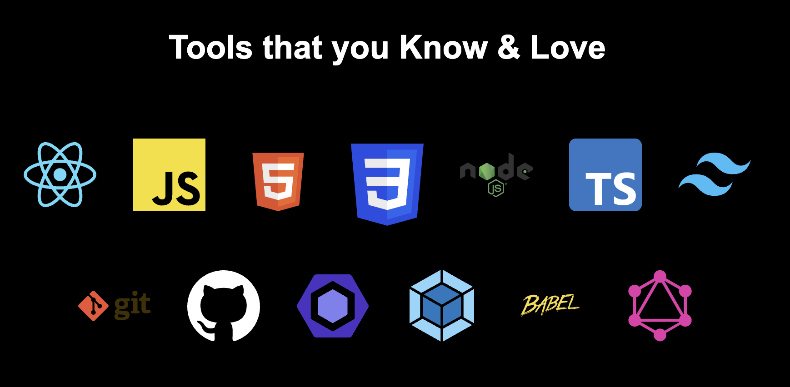 
    

- **How It Works** 🔄  
  A step-by-step guide that demonstrates how your product operates, making it easy for visitors to understand its benefits. 

  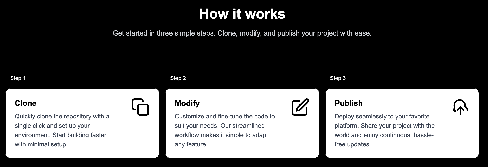 
    

- **Pricing** 💰  
  A section displaying various pricing plans and packages, helping visitors choose the option that best fits their needs.

  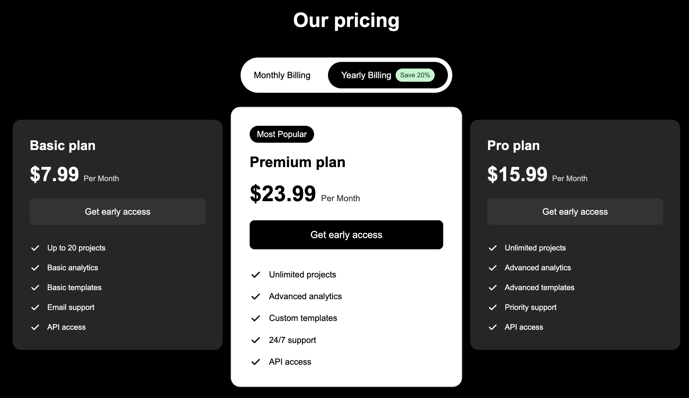 
  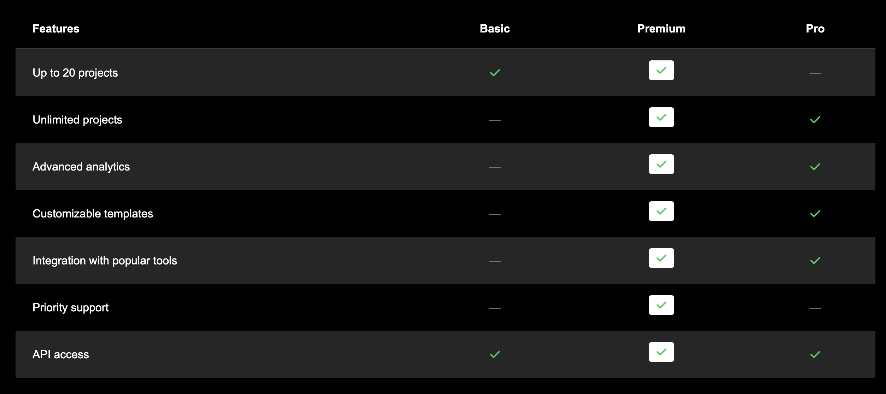
    

- **Testimonials** 💬  
  A carousel or slider showcasing feedback and reviews from satisfied customers.

  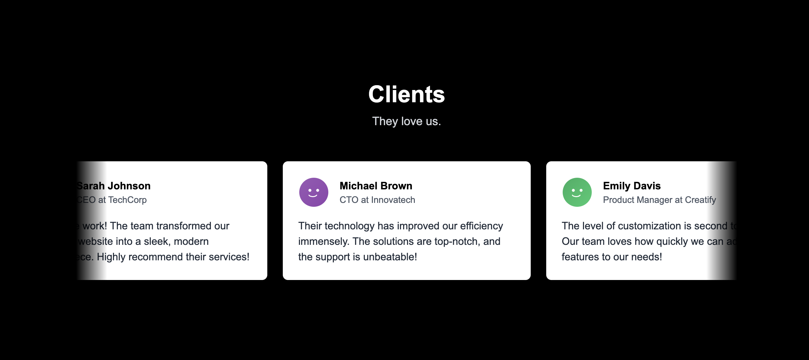  
    

- **CTA** 🚀  
  A compelling call-to-action section encouraging visitors to sign up or try your product. 
  
  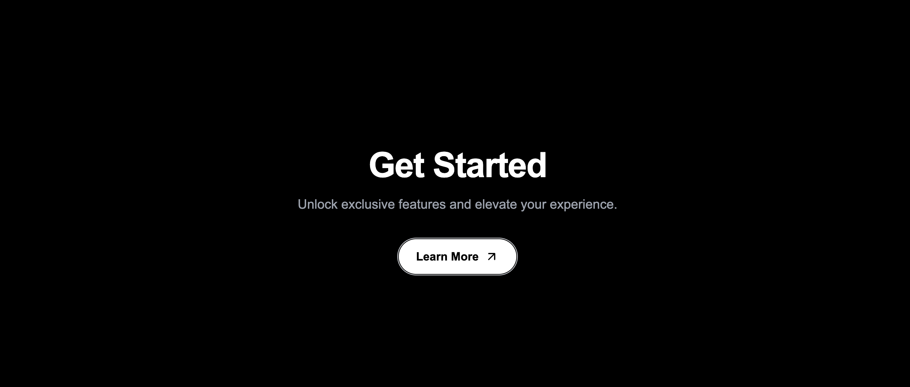 
    

- **Contact** 📞  
  A section providing your contact details—including email and social media links—so visitors can easily reach out.  
    

- **Footer** 🔗  
  The bottom navigation area with additional links, social media icons, and any other relevant information. 

  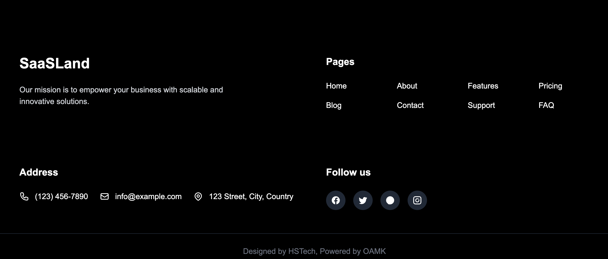 
    

#### The section names and their content may seem complicated in the project files. No worries, let's check the folder structure together:

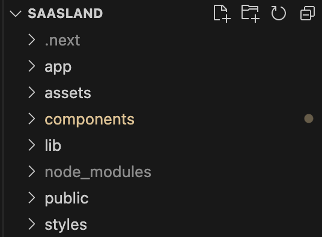

 

Inside the app folder, you'll find the global files. These files set up the foundational structure, styles, and layouts used across the entire application.

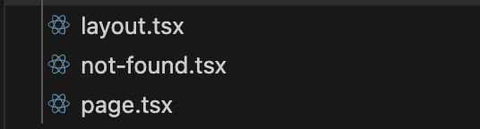

 

#### - layout.tsx  
This file is responsible for structuring the HTML layout of the application and including global UI components that remain consistent across all pages.

- It **imports global styles** from `"@/styles/globals.css"`, ensuring consistent design across the site.
- The **Navbar** and **Footer** components are included, meaning they are rendered on every page.
- It defines **metadata** (`title` and `description`) for the SaaS landing page, improving SEO.
- The `<main>` element wraps the `{children}` prop, which dynamically renders the content of different pages inside the layout.
- The entire application is wrapped inside `<html lang="en">` to set the language attribute properly.

This file ensures that every page has a **consistent layout**, with a navigation bar at the top, a main content area in the center, and a footer at the bottom.

 
 
#### - page.tsx 

This is our main page that renders everything. It includes all the sections—from the Navbar to the Contact section—in a container that defines the overall layout of the page.

It imports and renders all the key sections inside a `<main>` element, ensuring the correct structure and flow of the landing page.

- It **imports** components such as **Banner, Clients, About, Features, Tools, How It Works, Pricing, Testimonials, and CTA**.
- These components are **displayed sequentially**, forming the complete SaaS landing page.
- The `'use client'` directive ensures that the page is treated as a client-side component.

This file is responsible for assembling all sections into a fully functional landing page.

 

#### - not-found.tsx  
This file defines the **custom 404 (Not Found) page** for the SaaSLand project. It ensures that users who navigate to a non-existent route see a well-designed error page instead of a generic browser error.

- Displays a **"404"** heading, indicating that the page was not found.
- Shows a **message** informing users that the page might have been moved or doesn’t exist.
- Includes a **"Return Home"** button, allowing users to navigate back to the homepage.
- Uses **Next.js’s `Link` component** for efficient client-side navigation.
- The page is centered vertically and horizontally using **Tailwind CSS classes** for a clean UI.

This file ensures a **user-friendly error experience** by providing a clear message and an easy way to return to the main site.

#### ✨ Important Hint:
If you simply "Ctrl + Click" (Windows) or "Cmd + Click" (Mac) on a component's name in your code editor, you'll jump directly to its code. This is the easiest way to navigate between components.

## Component-Specific Instructions &nbsp; 🌄

How to modify the components will be explained more specifically below. If you are already a dev most probably you do not need that parts. However if you want some ai tool to manage this code and you lack the knowledge you can use the explanations below, it will take much less time 🤫

  

### Banner 🏠 

The **Banner** component is the first section of the landing page, featuring a **background video**, a **headline**, a **subheading**, a **CTA button**, and a **3D-styled image**.

### **How to Modify**

- **Update the Headline & Subheading**  
  Change the text inside the `<h1>` and `
` tags to match your brand message.
  
- **Modify the CTA Button**  
  Change the button text inside `<button>` and, if needed, wrap it in an `<a>` tag to link it to a signup page.

- **Replace the Background Video**  
  Update the `src` inside the `<video>` tag with your new video file, ensuring it is placed in `/public/video/`.

- **Change the 3D Image**  
  Replace the image source in `<Image src="/img/banner_img.jpeg" />` with your new image inside `/public/img/`.

- **Adjust Scroll Effects (Optional)**  
  Modify `offsetY` and `scale` inside the `imageTransform` object to increase or decrease movement on scroll.

- **Customize the CTA Hover Effect**  
  Update the gradient colors inside `.cta-container:hover::before` to align with your brand colors.

By following these steps, you can quickly personalize the **Banner** section to fit your SaaS product. 🚀

  

### About 🙎‍♂️

The **About** section introduces your SaaS product and explains its work system.

### **How to Modify**

- **Update the Title & Description**  
  Change the text inside the heading and paragraph elements to better reflect your product’s key features.

- **Replace the Image**  
  Update the image source by replacing the current file path with your own image. Ensure the new image is stored in the `/public/img/` directory.

- **Modify the CTA Button**  
  - Change the button text to match your preferred call to action.  
  - Update the `href` attribute to link the button to the correct page or section.

- **Customize the Button Hover Effect**  
  - Modify the border color, background, or padding to fit your brand style.  
  - Adjust the arrow animation inside the button by changing the hover transformation settings.

By following these steps, you can easily personalize the **About** section to align with your SaaS branding.

### Features 🔄

The **Features** section showcases the key functionalities of your SaaS product using multiple feature cards. Only the 3 concerns you to make basic modifications:

FeatureCard.tsx
 
Features.tsx
 
SpeacialFeatureCard.tsx

- `FeatureCard.tsx` → Handles **regular** feature cards with an icon, title, and description.
- `SpecialFeatureCard.tsx` → Displays the **highlighted feature**, with a large image and different styling.
- `Features.tsx` → Defines the structure of the **Features** section, determining how feature cards are arranged.

### **How to Modify**

#### **FeatureCard.tsx**
A standard feature block with an icon, title, and description.

- **Change the Feature Title & Description**  
  Modify the `title` and `description` props inside the `<h3>` and `
` tags.

- **Update the Feature Icon**  
  Replace the `icon` prop inside `` with your own image URL.

- **Customize Card Styling**  
  Adjust `className` properties inside `
` elements to change padding, border radius, or shadow effects.

#### **SpecialFeatureCard.tsx**
A unique feature card that stands out with a larger size and an image.

- **Modify the Feature Title & Description**  
  Update the `title` and `description` props to describe your standout feature.

- **Change the Image**  
  Replace the `image` prop inside `` with your own image URL.

- **Adjust Box Shadow & Borders**  
  Modify the `boxShadow` inside `style={{ boxShadow: 'inset 0 0 0 1px #000' }}` to enhance its design.

#### **Features.tsx**
The main section that organizes and displays the feature cards.

- **Change the Section Title & Description**  
  Modify the `<h2>` and `
` tags in the intro section.

- **Add, Remove, or Modify Features**  
  Update the `leftFeatures` and `rightFeatures` arrays to include more features or remove existing ones.

- **Change the Special Feature**  
  Modify the `SpecialFeatureCard` props (`title`, `description`, `image`) to feature a different standout functionality.

- **Adjust Scroll Animation**  
  Customize the `useFadeUp()` hook threshold or transition effects.

By following these steps, you can effectively personalize the **Features** section to highlight your SaaS product's core strengths. 🚀

### How It Works ⚡

The **How It Works** section explains the step-by-step process of using your product. It visually presents the workflow in three key steps: **Clone, Modify, and Publish**.

### **How to Modify**

#### **Steps (Clone, Modify, Publish)**
Each step contains three key properties:

- **Change the Step Title & Description**  
  Modify the `title` and `description` values inside the `steps` array.

- **Update the Step Icon**  
  Each step uses an inline **SVG icon** stored as a data URI. Replace the `icon` field in `steps` with a new **SVG image URI**.

- **Rearrange or Add More Steps**  
  To change the number of steps, modify the `steps` array:
  - **Add a step** → Add an object with `number`, `title`, `description`, and `icon`.
  - **Remove a step** → Delete the corresponding object.

#### **Step Component Styling**
Each step is rendered inside the `Step` component.

- **Modify Step Layout**  
  Update `className="w-full"` inside `<Step>` to adjust step width or alignment.

- **Change Step Number Style**  
  Modify `stepNumberColor="text-white"` to update the number color.

#### **Animations & Transitions**
The `useFadeUp` hook controls fade-up animation when scrolling.

- **Adjust Animation Timing**  
  Modify `duration-700` inside `transition-all duration-700` to speed up or slow down the effect.

- **Change Animation Threshold**  
  Update `{ threshold: 0.1 }` inside `IntersectionObserver` to trigger the animation earlier or later.

By following these steps, you can fully customize the **How It Works** section to match your product's workflow and branding. 🚀

### **Pricing 💰**  
The **Pricing** section displays different subscription plans, allowing users to compare features. It consists of two main components: **Pricing.tsx** (overall layout) and **PricingCard.tsx** (individual plan display).  

### **How to Modify**  
**Pricing Plans (Basic, Pro, Premium)**  
Each plan consists of three key properties:  
- **Change Plan Name & Price** → Modify the `name` and `price` fields in the `plans` array.  
- **Add or Remove Plans** →  
  - **Add a plan** → Insert an object with `name`, `price`, `features`, and optionally `isPopular`.  
  - **Remove a plan** → Delete the corresponding object.  

**Feature Matrix (Plan Comparisons)**  
The `featureMatrix` defines which features are included in each plan.  
- **Enable a Feature for a Plan** → Set `true` for the respective plan in `featureMatrix`.  
- **Remove a Feature** → Delete the feature from the `featureMatrix` array.  
- **Change Feature Name** → Update the `name` field inside `featureMatrix`.  

**PricingCard.tsx (Individual Plan Cards)**  
Each plan is rendered using the `PricingCard` component.  
- **Modify Card Styling** →  
  - `bg-white text-black ring-yellow-500` → Highlights the most popular plan.  
  - `bg-[#262626] text-white shadow-lg` → Styles non-popular plans.  
- **Update Call-to-Action Button** → Modify the `Get early access` button inside `<button>`.  
- **Customize Feature List Icons** →  
  - Change `fill="currentColor"` inside `<svg>` to update colors.  
  - Modify `w-5 h-5` to adjust icon size.  

**Billing Toggle (Monthly vs. Yearly)**  
Users can switch between monthly and yearly pricing.  
- **Set Default Billing Mode** → The `isYearly` state defaults to `true` (Yearly). Change it inside `useState(true)`.  
- **Modify Discount for Yearly Pricing** → Adjust the discount by changing `0.8` inside `price={isYearly ? (Number(plan.price) * 0.8).toFixed(2) : plan.price}`.  
- **Change Toggle Styling** → Modify `bg-green-200 text-green-900` for the discount badge.  

By following these steps, you can fully customize the **Pricing** section to reflect your product’s plans and branding. 🚀  

### **Testimonials ⭐**  
The **Testimonials** section showcases user reviews with avatar images, names, roles, and feedback.  

### **How to Modify**  
- **Update Testimonials Content** → Modify the `testimonials` array by changing `name`, `role`, and `content`.  
- **Replace Avatars** → Update the `image` field in the `testimonials` array with a new **SVG image URI** or a hosted image URL.  
- **Add or Remove Testimonials** →  
  - **Add a testimonial** → Insert an object with `name`, `role`, `content`, and `image`.  
  - **Remove a testimonial** → Delete the corresponding object.  
- **Modify Styling** →  
  - Adjust card appearance by changing `className="snap-center min-w-[320px] max-w-sm bg-white text-black p-6 rounded-lg shadow-md flex-shrink-0"`.  
  - Customize avatar size inside ``.  
  - Update testimonial text color by modifying `text-gray-800`.  
- **Adjust Scrolling Behavior** → Modify `overflow-x-auto snap-x snap-mandatory scrollbar-hide px-6` to change how testimonials scroll horizontally.  
- **Change Section Heading** → Update `<h2 className="text-4xl font-bold mb-2">Clients</h2>` to a different title.  

By making these adjustments, you can fully personalize the **Testimonials** section to fit your brand and audience. 🚀  

### **Clients 🌍**  
The **Clients** section displays logos of well-known brands using an auto-scrolling marquee effect.

### **How to Modify**  
- **Update Client Logos** → Modify the `clients` array by changing `name` and `logo` values with your own brand names and logo URLs.  
- **Add or Remove Clients** →  
  - **Add a client** → Insert an object with `name` and `logo` inside the `clients` array.  
  - **Remove a client** → Delete the corresponding object.  
- **Adjust Logo Appearance** →  
  - Modify `className="mx-auto filter grayscale brightness-125"` to change logo visibility, grayscale, or brightness.  
  - Update `w-[67px] sm:w-[134px]` to adjust logo size for different screen widths.  
- **Modify Scrolling Animation** →  
  - Change marquee speed by adjusting `animation: marquee 15s linear infinite;` inside `<style jsx>`.  
  - Modify animation direction by changing `translateX(0)` and `translateX(-50%)`.  
- **Background & Padding** →  
  - Update `style={{ backgroundColor: '#000000' }}` to change the background color.  
  - Modify `className="py-32"` to adjust the section's vertical spacing.

By making these changes, you can personalize the **Clients** section to highlight your product’s partnerships and collaborations. 🚀  

### **Tools 🛠️**  
The **Tools** section showcases the technologies used in the project, displayed in a two-row grid with a fade-up animation effect.

### **How to Modify**  
- **Update Tools List** → Modify the `toolIcons` array by changing `name` and `icon` values with your own tool names and logo URLs.  
- **Add or Remove Tools** →  
  - **Add a tool** → Insert an object with `id`, `name`, and `icon` inside the `toolIcons` array.  
  - **Remove a tool** → Delete the corresponding object.  
- **Rearrange Tool Layout** →  
  - The first row contains **7 tools**, and the second row contains **6 tools**. Adjust `slice(0,7)` and `slice(7)` to change how many tools appear in each row.  
- **Modify Animation Effect** →  
  - Adjust the fade-up animation timing by changing `duration-700` in the `transition-all duration-700` class.  
  - Modify the delay for the second row by updating `delay-150`.  
  - Change the animation trigger by modifying `{ threshold: 0.1 }` inside `IntersectionObserver`.  
- **Change Section Title & Spacing** →  
  - Update the `<h2>` text inside the `Tools` component to change the heading.  
  - Modify `py-20` inside `<section>` to adjust vertical padding.

By making these changes, you can personalize the **Tools** section to highlight the technologies that power your project. 🚀  

### **Call to Action (CTA) 🚀**  
The **CTA** section encourages users to take action with a clear heading, description, and button.

### **How to Modify**  
- **Change the Heading & Description** → Modify the `<h2>` and `
` tags to update the call-to-action message.  
- **Update the Button Text & Link** → Change the text inside `` and update the `href` inside `<a>` to point to a different page.  
- **Modify Button Styling** →  
  - Update `className` inside `.cta-button` to change colors, padding, or font size.  
  - Adjust `border: 1px solid #d1d5db;` in `.cta-container` to modify the border color.  
- **Change Button Animation** →  
  - Modify `transform: translateX(5px)` inside `.cta-container:hover .cta-arrow` to change the hover effect.  
  - Adjust `transition: all 0.2s ease-in-out;` for a faster or slower animation.  
- **Customize Section Appearance** →  
  - Modify `py-32` inside `<section>` to change vertical padding.  
  - Update `bg-black text-white` to use different background and text colors.  

By making these changes, you can tailor the **CTA** section to match your brand and drive conversions. 🔥  

### **Contact 📞**  
The **Contact** section allows users to reach out through multiple channels, including phone, email, social media, and a contact form.

### **How to Modify**  
- **Change the Heading & Description** → Update the `<h2>` and `
` inside the header to modify the section title and introductory text.  
- **Update Contact Information** → Modify the `Call Us`, `Email Us`, and `Visit Us` details inside their respective `
` tags.  
- **Customize Social Media Links** →  
  - Change the `href` value in `socialLinks` to point to your actual social media pages.  
  - Modify the `text-black` or `hover:bg-black` classes to adjust the icon colors.  
- **Modify Contact Form Fields** →  
  - Update `<label>` and `<input>` elements to add or remove fields.  
  - Change the `placeholder` and `id` attributes to match your needs.  
- **Update Button Styles** → Modify `className` inside the `<button>` element to change colors, size, or hover effects.  
- **Adjust Section Layout** → Modify `className` for `.grid md:grid-cols-2` to adjust the layout of contact information and form positioning.  

By making these changes, you can personalize the **Contact** section to fit your brand and customer engagement strategy. 📩  

### **Footer 🔗**  
The **Footer** section provides essential links, contact details, and social media connections for your website.

### **How to Modify**  
- **Change the Logo & Description** → Modify the `<h1>` and `
` inside the logo container to update the branding and mission statement.  
- **Update Page Links** → Modify the `<a>` tags inside the `Pages` section to change navigation links and labels.  
- **Modify Contact Information** → Update phone number, email, and address inside the `Address` section.  
- **Customize Social Media Links** →  
  - Change the `href` value in the social media `<a>` tags to point to your actual accounts.  
  - Adjust `hover:bg-gray-700` in the `className` attribute to modify hover effects.  
- **Update Copyright & Branding** → Modify the text inside the `
` tag at the bottom to change credit information.  
- **Adjust Footer Layout** → Modify `className` in the `<footer>` and grid structures to change spacing, alignment, and column behavior.  

By making these changes, you can tailor the **Footer** section to align with your brand’s identity and user engagement strategy.  

## Deployment &nbsp; 🚀

Deploying **SaaSLand** with **Vercel** is simple and requires just a few clicks. Follow these steps to get your project live in minutes.

### **How to Deploy on Vercel**  

1. **Create a Vercel Account**  
   - Visit [https://vercel.com/](https://vercel.com/) and sign up with **GitHub**.  

2. **Import the Repository**  
   - Click on **"New Project"** in the Vercel dashboard.  
   - Select **SaaSLand** from your GitHub repositories.  

3. **Configure Project Settings**  
   - Ensure the correct framework is detected: **Next.js**  
   - If needed, add environment variables in the **"Environment Variables"** section.  

4. **Deploy the Project**  
   - Click **"Deploy"** and wait for the build to complete.  
   - Once deployed, Vercel will provide a **live URL** to your site.  

5. **Set Up a Custom Domain (Optional)**  
   - Go to **Settings > Domains** and add your custom domain.  
   - Update your DNS settings to point to Vercel if required.  

6. **Enable Automatic Deployments**  
   - Any **push** to the repository will trigger an automatic deployment.  
   - You can manage branches and preview deployments in **Vercel's dashboard**.  

Your **SaaSLand** project is now live on Vercel! 🎉🚀  

## Contributors 🌟  

### - Shovan Das  🧙🏻‍♂️

### - Hakan Asmaoglu 🧑🏻‍🎨

 

## How to Contribute 🤝
 

We welcome contributions from developers, designers, and content creators! If you'd like to improve **SaaSLand**, follow these steps to contribute:  

- Fork the Repository  
Click the **Fork** button at the top right of this GitHub repository to create your own copy.  

- Clone Your Fork  
Clone your forked repository to your local machine.  

- Create a New Branch  
Before making changes, create a new branch for your feature or fix.  

- Install Dependencies  
Ensure you have all required dependencies installed.  

- Make Your Changes  
Modify the necessary files and test your changes locally.  

- Commit and Push  
Once you're happy with your changes, commit them and push to your branch.  

- Submit a Pull Request  
Go to the original repository on GitHub and click **New Pull Request**. Provide a clear description of your changes and submit the PR for review.  

Thanks for helping improve **SaaSLand**! 🦾  

## 🎊 CONGRATS 🎊

### You Did It!  

You've made it to the end, and that means you're ready to build something incredible with **SaaSLand**! 🚀  

Whether you're launching your next big SaaS product, crafting a sleek marketing page, or fine-tuning every pixel to perfection—**you’re in control now**. This guide has armed you with everything you need to customize, deploy, and scale your site with ease.  

💡 **Remember:** The web is your playground. Experiment. Customize. Break things and fix them. Your creativity is the only limit.  

If you ever need a hand, feel free to reach out, contribute, or just share your amazing project with us—we’d love to see what you create!  

Now go forth and **conquer the internet**. 🚀🔥  

**Happy building! 🎨💻**  